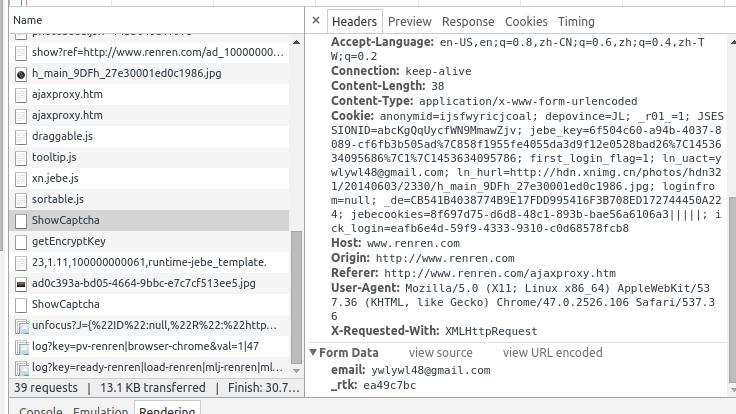
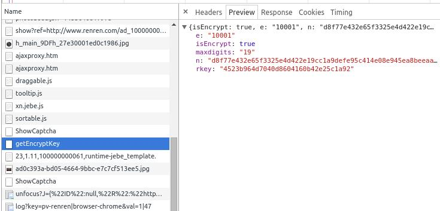

# 人人网的模拟登录

## 使用用户名和密码登录

## cookies操作

### requests保存Cookies的方法

```
    import pickle
    cookieFile = os.path.join(sys.path[0], "cookie")
    def save_cookies( requests_cookiejar):
        with open(self.cookieFile, "wb") as f:
            pickle.dump(requests_cookiejar, f)
            print("=" * 50)
            print("已在同目录下生成cookie文件：", self.cookieFile)
    
    def loadCookies():
        if os.path.exists(cookieFile):
            print("=" * 50)
            with open(cookieFile, "rb") as f:
                return pickle.load(f)
        return None

    #save cookies
    save_cookies(r.cookies, filename)

    #load cookies and do a request
    requests.get(url, cookies=load_cookies(filename))
```
`requests.utils.dict_from_cookiejar` and `requests.utils.cookiejar_from_dict` are not required. They don't save cookies with the same name for different domains and don't save all the required cookies data. I spent a lot of time debugging just because of these. 

### LWP save 1

If you want to save your cookies in human-readable format, you have to do some work to extract the RequestsCookieJar to a LWPCookieJar.

```
    import cookielib
    def save_cookies_lwp(cookiejar, filename):
        lwp_cookiejar = cookielib.LWPCookieJar()
        for c in cookiejar:
            args = dict(vars(c).items())
            args['rest'] = args['_rest']
            del args['_rest']
            c = cookielib.Cookie(**args)
            lwp_cookiejar.set_cookie(c)
        lwp_cookiejar.save(filename, ignore_discard=True)
    
    def load_cookies_from_lwp(filename):
        lwp_cookiejar = cookielib.LWPCookieJar()
        lwp_cookiejar.load(filename, ignore_discard=True)
        return lwp_cookiejar
    
    #save human-readable
    r = requests.get(url)
    save_cookies_lwp(r.cookies, filename)
    
    #you can pass a LWPCookieJar directly to requests
    requests.get(url, cookies=load_cookies_from_lwp(filename))
```
### LWP save 2

requests Sessions are documented to work with any cookielib CookieJar. The LWPCookieJar (and MozillaCookieJar) can save and load their cookies to and from a file. Here is a complete code snippet which will save and load cookies for a requests session. The ignore_discard parameter is used to work with httpbin for the test, but you may not want to include it your in real code.

```
    import os
    from cookielib import LWPCookieJar
    
    import requests
    
    
    s = requests.Session()
    s.cookies = LWPCookieJar('cookiejar')
    if not os.path.exists('cookiejar'):
        # Create a new cookies file and set our Session's cookies
        print('setting cookies')
        s.cookies.save()
        r = s.get('http://httpbin.org/cookies/set?k1=v1&k2=v2')
    else:
        # Load saved cookies from the file and use them in a request
        print('loading saved cookies')
        s.cookies.load(ignore_discard=True)
        r = s.get('http://httpbin.org/cookies')
    print(r.text)
    # Save the session's cookies back to the file
    s.cookies.save(ignore_discard=True)
```
### pickle save added

I found that the other answers had problems:

* They didn't apply to sessions.
* They didn't save and load properly. Only the cookie name and value was saved, the expiry date, domain name, etc. was all lost.

This answer fixes these two issues:

```
    import requests.cookies
    
    def save_cookies(session, filename):
        if not os.path.isdir(os.path.dirname(filename)):
            return False
        with open(filename, 'w') as f:
            f.truncate()
            pickle.dump(session.cookies._cookies, f)
    
    
    def load_cookies(session, filename):
        if not os.path.isfile(filename):
            return False
    
        with open(filename) as f:
            cookies = pickle.load(f)
            if cookies:
                jar = requests.cookies.RequestsCookieJar()
                jar._cookies = cookies
                session.cookies = jar
            else:
                return False
```
Then just call `save_cookies(session, filename)` to save or `load_cookies(session, filename)` to load. Simple as that.


## 是否需要输入验证码 showcatpcha

在输入用户名后，点击密码的输入框，这时候，浏览器会发出POST请求，判断是否需要输入验证码


从图中可以看出，form data有两个key，一个是`email`，这个是我们输入的用户名，另一个是`_rtk`

第一时间，打开页面的源代码，复制rtk的值，查看是否rtk的值在打开主页面的时候就已经确定。

可以查找到


可以向主页发出GET请求，然后用正则表达式匹配出来。

得到 `rtk`的值后，发出POST请求，得到Response，1表示需要输入验证码，0表示不需要验证码
```
    import requests
    import re
    usrname = "yanweilin"
    url = "http://www.renren.com"
    showcaptchaurl = "http://www.renren.com/ajax/ShowCaptcha"
    res = requests.get(url, timeout = 10)
    m = re.search ("_rtk\s*:\s*'(?P<rtk>\w+)'", res.text)
    print(m.group("rtk"))
    rtk = m.group("rtk")
    captchadata = {
        "email" : usrname , 
        "_rtk" : rtk
            }
    res = requests.post(showcaptchaurl, data = captchadata, timeout = 10)
    if res.text.strip()=="1" :
        print ("需要输入验证码")
        pass
    else :
        print ("不需要验证码")
```


## 密码的加密方式

### 概述

参考文档：
1. [解开人人网登录密码的 RSA 加密](https://ring0.me/2014/05/renren-password-transfer-security/)

人人网对密码采用RSA的加密方式

登录主页`http://renren.com`后，浏览器发起 `getEncryptionKey` 请求，服务器生成一对 256 位的 RSA 公私钥，随机生成一个 rkey，以 rkey 为索引把公私钥存储起来。
)

这几个参数可通过requests(或者是其他HTTP库)GET请求，解析Json格式的Response得到

    import requests
    import json
    getEncryptKeyurl = "http://login.renren.com/ajax/getEncryptKey"
    res = requests.get(getEncryptKeyurl, timeout = 10)
    rkey = res.json()

`isEncrypt = 1`表示密码采用加密的方式传输

`maxdigits = 19` ?????

服务器把 e（固定为 16 进制的 10001）、n（16 进制表示的 256 位公钥）、rkey 发回给浏览器。

用户输入密码并点击登录时，浏览器把密码用公钥 n 和指数 e 加密，得到 password（16 进制表示的 256 位），连同 rkey 发送给服务器。

服务器根据 rkey 取出私钥，解密 password 得到明文密码，然后就是常规的密码检查流程了。

### 密码加密的代码实现

加密的算法在前端login.js中实现

#### 方法一
参考文档：
1.  [模拟登录人人-github](https://gist.github.com/wong2/4433334)  
    _注：python2.x代码，python3相对于python2.x，map函数和print函数的代码有所改变_

```
    #-*-coding:utf-8-*-
    # 人人网密码的加密方式
    
    # 分段加密
    CHUNK_SIZE = 30
    
    # RSA加密
    def enctypt(e, m, c):
        return pow(c, e, m)
    
    # 加密一段
    def enctyptChunk(e, m, chunk):
        chunk = list(map(ord, chunk))
        # chunk = map(ord, chunk)  # python2.x
    
        # 补成偶数长度
        if not len(chunk) % 2 == 0:
            chunk.append(0)
    
        nums = [ chunk[i] + (chunk[i+1] << 8) for i in range(0, len(chunk), 2) ]
    
        c = sum([n << i*16 for i, n in enumerate(nums)])
    
        encypted = enctypt(e, m, c)
    
        # 转成16进制并且去掉开头的0x
        return hex(encypted)[2:]
    
    # 加密字符串，如果比较长，则分段加密
    def encryptString(e, m, s):
        e, m = int(e, 16), int(m, 16)
    
        chunks = [ s[:CHUNK_SIZE], s[CHUNK_SIZE:] ] if len(s) > CHUNK_SIZE else [s]
    
        result = [enctyptChunk(e, m, chunk) for chunk in chunks]
        # return ' '.join(result)[:-1] # python2.x, 去掉最后的'L'
        return ' '.join(result)
    
    if __name__ == '__main__':
        print (encryptString('10001', '856381005a1659cb02d13f3837ae6bb0fab86012effb3a41c8b84badce287759', 'yanweilin'))
```
#### 方法二

TBD
